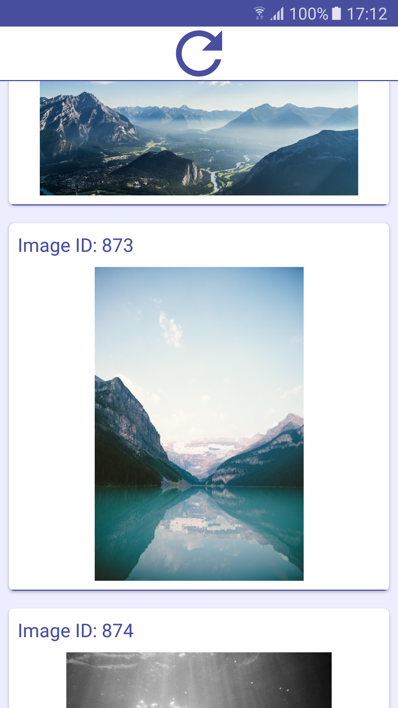
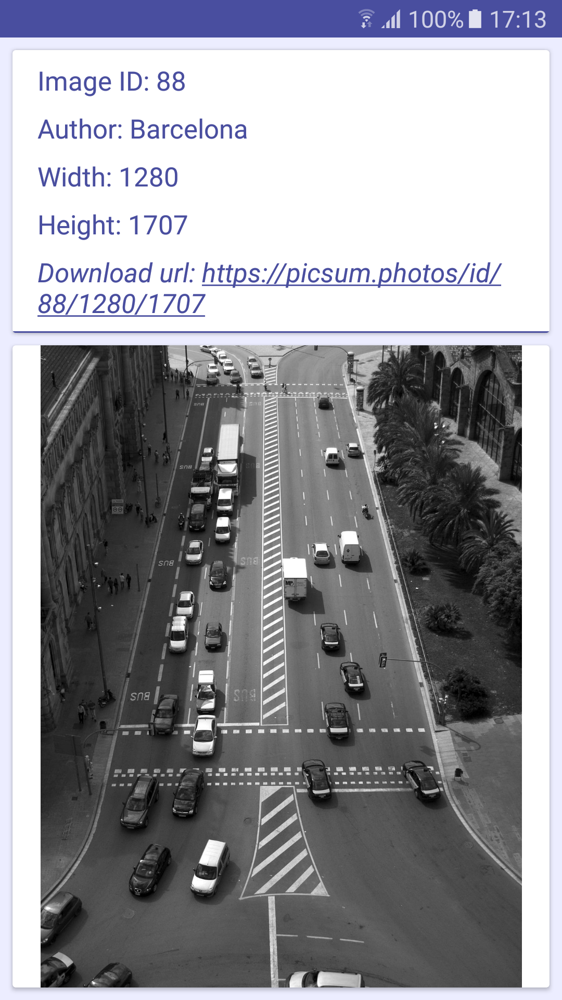
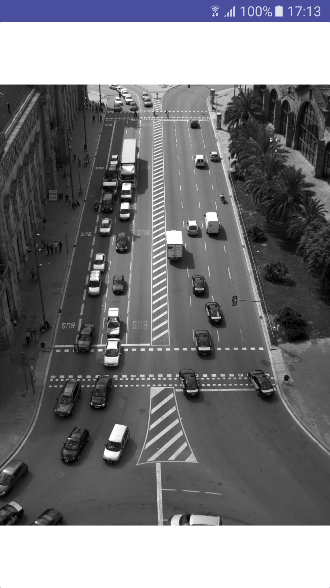

# Images browser

Android app that allows browsing images.

# Demo

# UI description

## Images list activity

Entry activity of the application. Shows to users images in a list. When the user clicks the refresh button app downloads 20 new images.

   

## Image details activity

If the user clicks on a list item in the images list activity, the app goes to the image details activity where the user can see details about the image. The user can make image bigger by swiping it up.

   